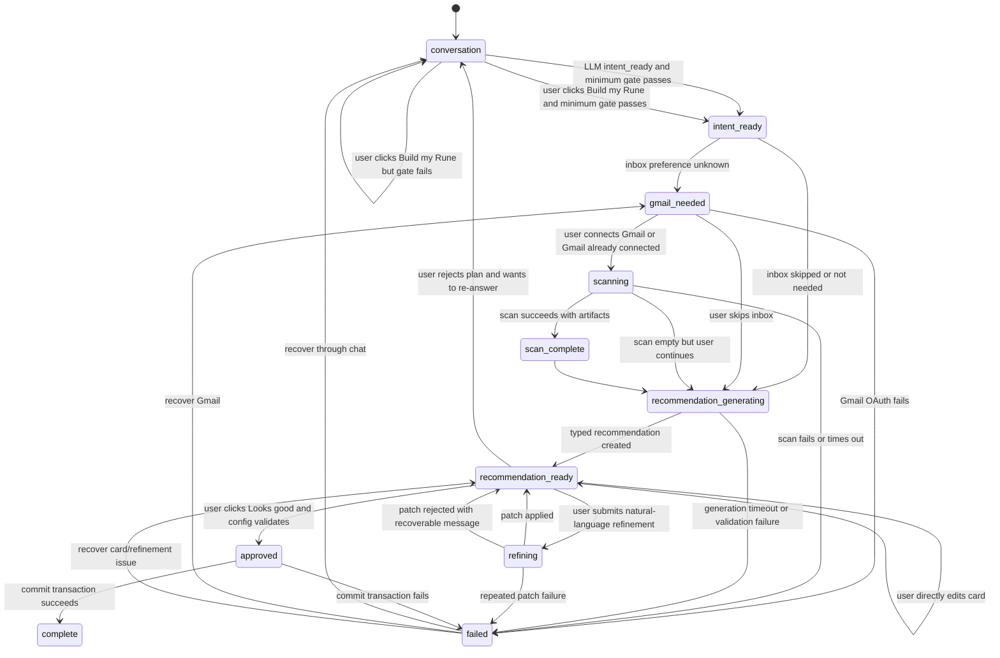

# Onboarding Spec

Last updated: 2026-05-26
Status: draft for human approval before Phase 0c implementation
File: `docs/ONBOARDING_SPEC.md`

This spec defines the Phase 0c onboarding product spine. It is intentionally build-facing: frontend behavior, backend state, persistence, validation, and telemetry live in one contract so the implementation does not drift.

## Goal

Onboarding should feel conversational while discovery is useful, then become concrete and inspectable before the user commits.

The product shape is:

```text
chat discovery -> contextual inbox choice -> optional Gmail scan -> visual Rune plan -> editable cards -> approval
```

The structural rule is:

```text
Frontend renders server state. Server owns onboarding truth.
```

No critical onboarding state should depend on `sessionStorage`.

## Product Principles

- Chat is for discovery, not for hiding state.
- The recommendation view is an editable setup workspace, not a static summary.
- Gmail is contextual. The user is choosing inbox curation, not connecting a random integration.
- `skipped` is a first-class inbox preference, not a failure.
- Recommendation refinement is a loop, not a one-way step.
- Every structured LLM output uses the Phase 0b gateway and a Zod schema.
- Artifacts are keyed by `rune_id` even during one-Rune alpha.

## Alpha Scope

Alpha supports one Rune per user.

Implementation should still introduce and persist a `rune_id` so multi-Rune flows can be added later without reshaping every onboarding artifact.

## State Machine

### Persisted States

| State | Meaning | User-visible surface |
| --- | --- | --- |
| `conversation` | Rune is gathering intent through chat | Chat discovery |
| `intent_ready` | Minimum intent exists and can generate a plan | Transition/loading state |
| `gmail_needed` | User must choose whether inbox curation is wanted | Contextual Gmail/inbox choice |
| `scanning` | Gmail scan or inbox artifact processing is running | Scan progress |
| `scan_complete` | Scan produced durable artifacts | Brief scan result, then recommendation generation |
| `recommendation_generating` | Backend is creating typed recommendation config | Loading state |
| `recommendation_ready` | User can inspect/edit/approve cards | Rune plan workspace |
| `refining` | Natural-language refinement or card patch is being applied | Rune plan with pending patch state |
| `approved` | User approved the typed config | Setup commit/loading state |
| `complete` | Onboarding is committed and daily Rune is scheduled | Success/next delivery state |
| `failed` | Recoverable or terminal failure with `failure_code` | Failure-specific recovery UI |

### State Diagram



### Transition Guards

| Transition | Guard |
| --- | --- |
| `conversation -> intent_ready` | Minimum intent gate passes |
| `intent_ready -> gmail_needed` | `inbox_preference.status === "unknown"` |
| `intent_ready -> recommendation_generating` | inbox skipped, not wanted, or already scanned |
| `gmail_needed -> scanning` | Gmail connected and inbox curation wanted |
| `gmail_needed -> recommendation_generating` | `inbox_preference.status === "skipped"` or `wants_inbox_curation === false` |
| `recommendation_ready -> approved` | Full recommendation config validates |
| `refining -> recommendation_ready` | Patch applies cleanly and recommendation config still validates |

## Minimum Intent Gate

The user can leave chat when the backend has enough structured intent to create at least one valid card.

The gate passes only when all four fields are satisfied:

| Field | Requirement | Recovery if missing |
| --- | --- | --- |
| Slot type | At least one inferred or chosen type: `news`, `lesson`, or `inbox` | Ask what Rune should track, teach, or curate |
| Meaningful focus | At least one topic, beat, or learning goal with a meaningful description | Ask for a concrete focus |
| Delivery preference | Delivery time/timezone/style chosen or defaulted | Apply defaults and show them on delivery card |
| Inbox preference | Answered as `wanted`, `not_wanted`, or `skipped` | Ask whether Rune should inspect inbox updates |

### Meaningful Focus Rule

A focus is not meaningful if it is only a generic category like:

```text
AI
news
business
technology
markets
politics
```

A focus is meaningful if it adds domain, geography, role lens, entity, or outcome:

```text
AI regulation affecting US financial services
commercial real estate distress in Florida
daily macro indicators for real estate investing
learn monetary policy transmission from beginner to intermediate
```

### Build My Rune Behavior

The user may click `Build my Rune` from chat.

If the minimum gate passes:

```text
conversation -> intent_ready
```

If the gate fails, the server returns:

```ts
type MinimumIntentGateFailure = {
  ok: false
  reason: "minimum_intent_missing"
  missing_fields: Array<"slot_type" | "meaningful_focus" | "delivery_preference" | "inbox_preference">
  rune_message: string
}
```

The UI shows the `rune_message` in chat. Example:

```text
I need one more thing: what should I focus on each morning?
```

## Frontend Surfaces

### Chat Discovery

Purpose:

- Learn user context and desired outcomes.
- Keep the experience lightweight and human.
- Produce typed intent, not final configuration.

Required controls:

- Chat input.
- `Build my Rune` action once there is at least some user-provided signal.
- Optional small progress indicator based on missing gate fields.

### Contextual Inbox Choice

Purpose:

- Ask whether Rune should inspect inbox updates, newsletters, and recurring emails.

User choices:

```ts
type InboxPreferenceStatus = "wanted" | "not_wanted" | "skipped" | "unknown"
```

Copy direction:

```text
Rune can scan your inbox for newsletters and recurring updates worth including.
```

Not:

```text
Connect Gmail to continue.
```

### Rune Plan Workspace

Purpose:

- Show the user what Rune will do.
- Let them edit before approval.
- Keep chat refinement available without sending the user backward.

Layout:

- Recommendation message at top.
- Editable cards below.
- Persistent refinement input below cards.
- Approval action pinned or clearly available.

Persistent refinement placeholder:

```text
Refine your Rune - try "less broad", "remove politics", "add proptech"
```

## Card Schemas

Cards are the visible version of backend slots. They should use human labels in UI, while preserving typed backend fields.

### Shared Card Fields

```ts
type BaseOnboardingCard = {
  id: string
  rune_id: string
  type: "news" | "lesson" | "inbox" | "delivery"
  title: string
  rationale?: string
  status: "draft" | "valid" | "invalid" | "pending_patch"
  validation_errors: string[]
  updated_at: string
}
```

### News Beat Card

UI labels:

- Track this
- Focus on
- Entities
- Preferred sources
- Blocked sources
- Avoid

Schema:

```ts
type NewsBeatCard = BaseOnboardingCard & {
  type: "news"
  focus: string
  scope_summary: string
  tracked_entities: string[]
  preferred_sources: string[]
  blocked_sources: string[]
  avoid_terms: string[]
  retrieval_queries: string[]
  required_terms: string[][]
}
```

Defaults:

- `tracked_entities`: `[]`
- `preferred_sources`: `[]`
- `blocked_sources`: `[]`
- `avoid_terms`: `[]`
- `retrieval_queries`: generated by backend
- `required_terms`: generated by backend

Validation:

- `focus` must pass meaningful focus rule.
- `scope_summary` required.
- At least one `retrieval_query` required before approval.
- At least one `required_terms` group required before approval.
- `blocked_sources` cannot overlap `preferred_sources`.

Advanced fields:

- `retrieval_queries` and `required_terms` may be hidden in v1 UI but must exist in the typed config.

### Lesson Track Card

UI labels:

- Learn this
- Starting level
- Goal
- Depth

Schema:

```ts
type LessonTrackCard = BaseOnboardingCard & {
  type: "lesson"
  topic: string
  starting_level: "beginner" | "intermediate" | "advanced"
  curriculum_goal: string
  depth: "quick" | "standard" | "deep"
  scope_summary?: string
}
```

Defaults:

- `starting_level`: `"beginner"`
- `depth`: `"standard"`

Validation:

- `topic` must pass meaningful focus rule.
- `curriculum_goal` required before approval.
- `starting_level` must be one of the enum values.

### Inbox Card

UI labels:

- Include these senders
- Exclude these senders
- Surface these updates
- Scan status

Schema:

```ts
type InboxCard = BaseOnboardingCard & {
  type: "inbox"
  preference_status: "wanted" | "not_wanted" | "skipped"
  scan_status: "not_started" | "running" | "complete" | "empty" | "failed"
  selected_senders: Array<{
    address: string
    name?: string
    content_type?: string
    reason?: string
  }>
  blocked_senders: string[]
  content_types: string[]
  gap_note?: string
}
```

Defaults:

- `preference_status`: `"skipped"` if user skips inbox.
- `selected_senders`: `[]`
- `blocked_senders`: `[]`
- `content_types`: `[]`

Validation:

- If `preference_status === "wanted"`, Gmail must be connected or recovery UI must show.
- Empty scan is valid if user continues without inbox curation.
- `selected_senders` and `blocked_senders` cannot overlap.

### Delivery Card

UI labels:

- Delivery time
- Timezone
- Length
- Style

Schema:

```ts
type DeliveryCard = BaseOnboardingCard & {
  type: "delivery"
  cadence: "daily"
  send_time: string
  timezone: string
  length: "short" | "standard" | "deep"
  style: "morning-brief" | "reference-mode" | "deep-read"
}
```

Defaults:

- `cadence`: `"daily"`
- `send_time`: `"07:00"`
- `timezone`: browser/user profile timezone, fallback `"America/New_York"`
- `length`: `"standard"`
- `style`: `"morning-brief"`

Validation:

- `send_time` must be `HH:mm`.
- `timezone` must be an IANA timezone string.
- Cadence is daily-only in alpha.

## Refinement Loop

The recommendation workspace has a persistent input below the cards.

The user can refine globally:

```text
make it less broad
remove politics
add proptech
focus more on distressed debt
```

The user can also edit cards directly.

### Refinement Flow

```text
recommendation_ready -> refining -> recommendation_ready
```

### Request Contract

```ts
type RefineRuneRequest = {
  rune_id: string
  onboarding_session_id: string
  recommendation_version_id: string
  instruction: string
  target_card_id?: string
  current_config_version: number
}
```

Validation:

- `instruction` required.
- `recommendation_version_id` must match latest visible version unless the client refreshes.
- `target_card_id` optional. If present, patch should be scoped to that card unless the instruction clearly requires cross-card changes.

### LLM Patch Schema

The natural-language refinement patch is an LLM call and must use the Phase 0b gateway.

```ts
type OnboardingRefinementPatch = {
  summary: string
  operations: Array<
    | {
        op: "update_card"
        card_id: string
        fields: Record<string, unknown>
      }
    | {
        op: "add_card"
        card: NewsBeatCard | LessonTrackCard | InboxCard | DeliveryCard
      }
    | {
        op: "remove_card"
        card_id: string
        reason: string
      }
    | {
        op: "update_delivery"
        fields: Partial<DeliveryCard>
      }
  >
  clarifying_question?: string
}
```

Patch rules:

- Patch cannot modify `user_id`, OAuth tokens, raw Gmail data, telemetry, or approval state.
- Patch cannot create unsupported card types.
- Patch cannot remove the final remaining non-delivery card unless it returns a `clarifying_question`.
- Patch must preserve the minimum intent gate.
- Patch must validate the full recommendation config after application.

If patch application succeeds:

```text
refinement_applied
recommendation_ready
```

If patch validation fails:

```text
refinement_failed
recommendation_ready with recoverable message
```

## Failure States

| Failure mode | UI state | Recovery path |
| --- | --- | --- |
| Empty inbox scan | Show empty inbox card with explanation | Continue without inbox, retry scan, or pick senders manually later |
| Gmail OAuth failed | Show Gmail recovery state | Retry connection or skip inbox |
| Gmail revoked mid-onboarding | Show disconnected inbox card | Reconnect or mark inbox skipped |
| Recommendation generation timeout | Show recoverable generation failure | Retry generation or return to chat |
| Recommendation validation failure | Show "I need to rebuild that plan" state | Retry generation; record validation failure |
| User rejects recommendation | Return to chat with current cards summarized | Continue conversation and regenerate |
| Minimum intent gate fails | Chat nudge for missing fields | Ask one focused question |
| Refinement patch fails | Keep prior cards visible | Show recoverable message and allow another instruction |
| Approval commit fails | Keep approved draft visible | Retry commit; do not lose edits |

Failure UI should avoid dead ends. Every failure state has a primary recovery action and a secondary escape action.

## Telemetry

All onboarding telemetry must be privacy-minimal. Do not store raw email bodies, OAuth tokens, or secret values in telemetry payloads.

### Shared Payload Fields

```ts
type OnboardingEventBase = {
  event_id: string
  event_name: string
  user_id: string
  rune_id: string
  onboarding_session_id: string
  state: string
  previous_state?: string
  created_at: string
  source: "client" | "server"
}
```

### Events

| Event | Required extra payload |
| --- | --- |
| `chat_message_sent` | `message_length`, `conversation_turn_count` |
| `chat_message_received` | `message_length`, `has_intent_signal`, `latency_ms` |
| `build_my_rune_clicked` | `minimum_gate_passed`, `missing_fields` |
| `minimum_intent_gate_failed` | `missing_fields` |
| `intent_ready` | `slot_types`, `has_inbox_preference`, `focus_count` |
| `inbox_preference_set` | `preference_status` |
| `gmail_connect_started` | `redirect_target` |
| `gmail_connect_completed` | `has_refresh_token` |
| `gmail_connect_failed` | `error_code` |
| `scan_started` | `provider` |
| `scan_completed` | `sender_count`, `candidate_count`, `selected_count`, `latency_ms` |
| `scan_empty` | `sender_count`, `candidate_count` |
| `scan_failed` | `error_code`, `retryable` |
| `recommendation_generation_started` | `slot_types`, `has_scan_artifact` |
| `recommendation_shown` | `card_count`, `card_types`, `generation_latency_ms` |
| `recommendation_generation_failed` | `error_code`, `retryable` |
| `card_edited` | `card_id`, `card_type`, `field_names`, `config_version` |
| `refinement_submitted` | `instruction_length`, `target_card_id`, `config_version` |
| `refinement_applied` | `operation_count`, `changed_card_ids`, `latency_ms`, `config_version` |
| `refinement_failed` | `error_code`, `target_card_id`, `retryable` |
| `approved` | `card_count`, `card_types`, `config_version` |
| `approval_failed` | `error_code`, `retryable` |
| `complete` | `first_delivery_at` |
| `abandoned` | `last_state`, `duration_ms` |

Onboarding funnel drop-off analysis is a Phase 0c deliverable.

## Persistence Rules

### Must Persist

All of these are keyed by `rune_id` and `user_id`.

| Artifact | Purpose |
| --- | --- |
| Rune shell | Single alpha Rune per user, future multi-Rune ready |
| Onboarding session | Current state, version, started/completed timestamps |
| State transition log | Debugging, recovery, funnel analysis |
| Conversation messages or summary | Reload/resume and recommendation grounding |
| Structured intent | Minimum gate and recommendation generation |
| Inbox preference | Wanted, not wanted, skipped, unknown |
| Gmail connection status | Connected/disconnected, no tokens in telemetry |
| Inbox scan artifact | Sender candidates, selected/blocked senders, scan summary |
| Recommendation versions | Typed card config and generated user-facing summary |
| Card edits | Audit/refinement recovery |
| Approval artifact | Final config submitted to commit transaction |
| Telemetry events | Funnel and reliability analysis |

### Can Be Ephemeral

- Current text input value.
- Typing animation state.
- Local scroll position.
- Client-only optimistic draft before server acknowledges.
- Cosmetic UI expansion/collapse state.

### Reload Behavior

On page load, frontend requests the current onboarding session by `rune_id` or current user's active alpha Rune.

The server returns:

```ts
type OnboardingSnapshot = {
  rune_id: string
  onboarding_session_id: string
  state: string
  minimum_intent_gate: {
    passed: boolean
    missing_fields: string[]
  }
  conversation: {
    messages: Array<{ role: "user" | "rune"; content: string; created_at: string }>
    summary?: string
  }
  intent?: unknown
  inbox_preference: InboxPreferenceStatus
  scan_artifact?: unknown
  recommendation?: {
    version_id: string
    config_version: number
    cards: Array<NewsBeatCard | LessonTrackCard | InboxCard | DeliveryCard>
    user_facing_summary: string[]
  }
  failure?: {
    code: string
    retryable: boolean
    message: string
  }
}
```

The frontend renders from this snapshot. It does not reconstruct critical state from local storage.

## Backend Implementation Notes

Suggested Phase 0c API surfaces:

| Endpoint | Purpose |
| --- | --- |
| `GET /api/onboard/state` | Return current `OnboardingSnapshot` |
| `POST /api/onboard/chat` | Send chat turn and maybe advance state |
| `POST /api/onboard/build` | User-triggered Build my Rune action and minimum gate check |
| `POST /api/onboard/inbox-preference` | Persist wanted/not wanted/skipped |
| `POST /api/onboard/scan-inbox` | Start or resume scan |
| `POST /api/onboard/recommendation` | Generate or regenerate typed cards |
| `PATCH /api/onboard/cards/:cardId` | Direct card edit |
| `POST /api/onboard/refine` | Natural-language card/config patch |
| `POST /api/onboard/approve` | Commit validated config |

Implementation can keep existing endpoints temporarily, but frontend should move toward this state-based contract.

## Validation Before Approval

Approval requires:

- Minimum intent gate passes.
- At least one non-delivery card exists.
- Delivery card is valid.
- Every card has `status === "valid"`.
- Full typed recommendation config validates with Zod.
- If inbox card is wanted, scan is complete or user explicitly accepts partial/empty inbox curation.

## Out Of Scope For Phase 0c

- Multi-Rune UI.
- Full graph visualization.
- Entity graph infrastructure.
- Gmail OAuth rebuild.
- New search providers.
- Query decomposition engine.
- Production billing/pricing.
- Major redesign of the final digest email.

## Phase 0c Acceptance Criteria

- Refreshing during onboarding resumes from server state.
- `Build my Rune` never fails silently.
- Inbox skip is persisted and treated as valid.
- Recommendation cards are editable directly.
- Natural-language refinement can patch typed cards through the gateway.
- User can reject a recommendation and continue refining.
- Approval commits one validated config.
- Onboarding state transitions and card edits emit telemetry.
- Existing dashboard-era onboarding paths are gated, quarantined, or removed after the new path is stable.
